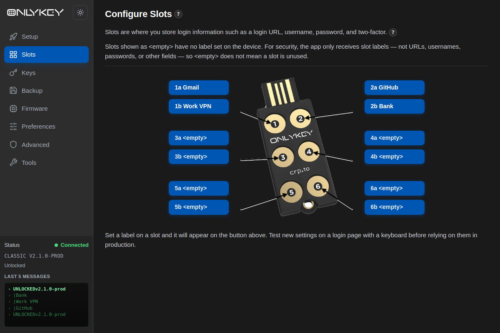
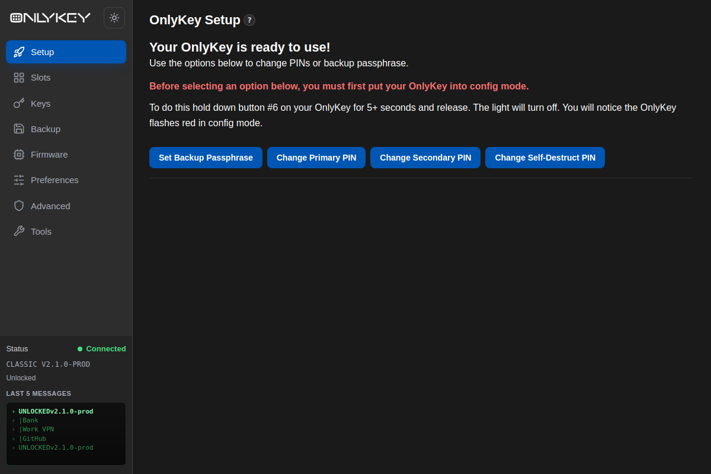
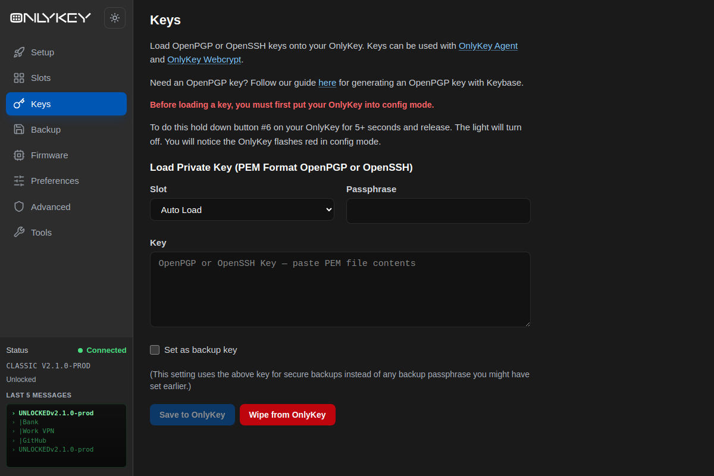
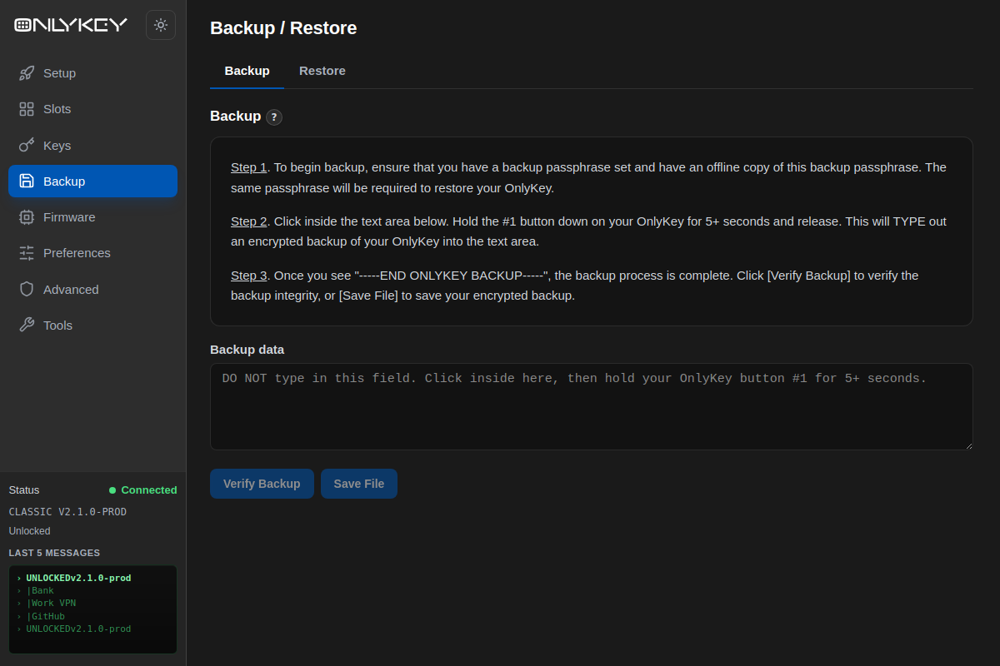
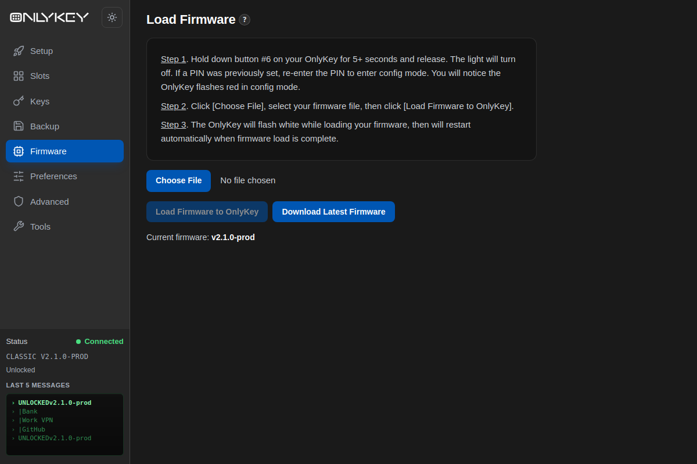
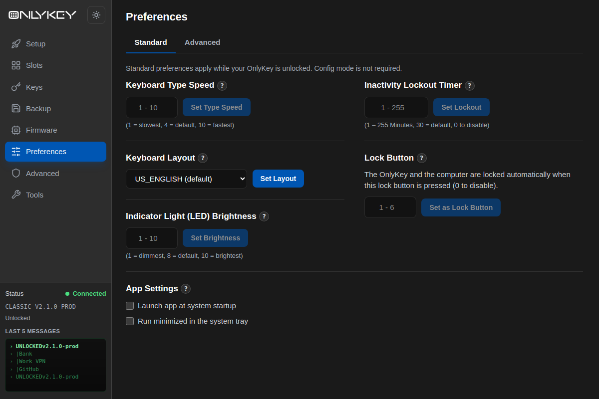
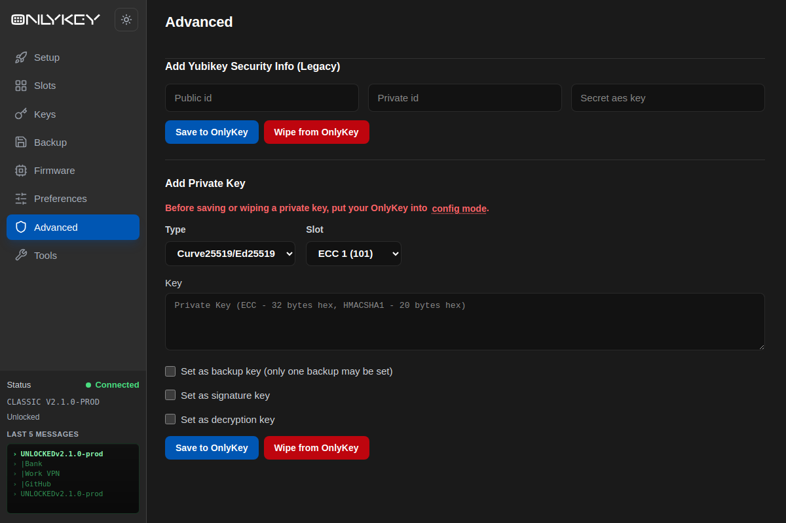
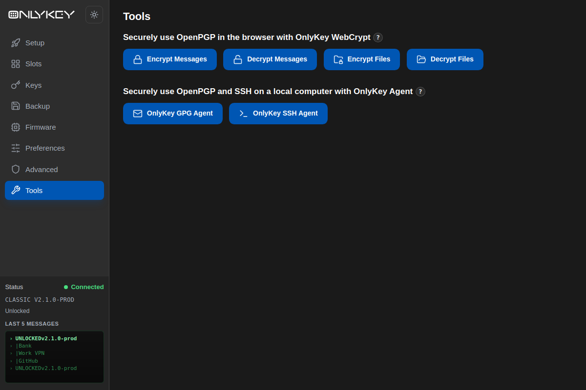

# OnlyKey App (Community Fork)

> **Note:** This is **not** the official OnlyKey app. It is a community-maintained fork of the official [trustcrypto/OnlyKey-App](https://github.com/trustcrypto/OnlyKey-App) repository, created because development of the official app appears to have stalled. This fork aims to deliver much-needed improvements and keep the app usable on modern systems. It is not affiliated with or endorsed by CryptoTrust LLC.

## Why this fork?

The official OnlyKey app has not seen active development for some time, while the platform it was built on (NW.js) and its dependencies have aged. This fork picks up where the official app left off, with changes such as:

- Migration from NW.js to [Electron](https://www.electronjs.org/), with device access through WebHID
- An overhauled UI layout
- Rebuilt packaging and release tooling, with modernized dependencies

Bug reports and contributions are welcome via this repository's issue tracker and pull requests.

OnlyKey can be purchased here: [OnlyKey order](http://www.crp.to/p/)

## Getting Started

Just getting started with OnlyKey?

[Start here](http://www.crp.to/okstart)

## About

**OnlyKey App** is a desktop app (Windows, macOS, Linux) used along with an OnlyKey or OnlyKey DUO device. The app is used for things like:

- Initial setup of OnlyKey (Setup)
- Configuration of accounts (Slots)
- Loading keys for PGP, SSH, and secure backup (Keys)
- Backup and restore of OnlyKey (Backup/Restore)
- Loading and upgrading firmware (Firmware)
- Setting OnlyKey preferences such as keyboard layout, type speed, and lockout (Preferences)
- Setting advanced options such as Yubikey security info and private keys (Advanced)
- Links to companion tools like OnlyKey WebCrypt and the SSH/GPG agents (Tools)

*The app is required on all systems where OATH-TOTP (Google Authenticator) is used*

For information on using the app see the [OnlyKey User's Guide](https://docs.crp.to/usersguide.html) or [OnlyKey DUO User's Guide](https://docs.crp.to/duousersguide.html)

## Screenshots

The UI has been significantly reworked compared to the official app, with a sidebar navigation and live device status:

| | |
|:---:|:---:|
|  |  |
| *Setup* | *Keys* |
|  |  |
| *Backup/Restore* | *Firmware* |
|  |  |
| *Preferences* | *Advanced* |
|  | |
| *Tools* | |

## Installation

- Obtain an installer for your OS from this fork's [releases page](https://github.com/drewfarnese/OnlyKey-App/releases/latest).
- Install and launch the app.

Installers for the official (unmaintained) app remain available on the [official releases page](https://github.com/trustcrypto/OnlyKey-App/releases/latest).

Linux users installing the deb package should verify the GPG signature using `debsig-verify`. There is an article outlining this process [here](https://www.unboundsecurity.com/docs/UKC/UKC_Code_Signing_IG/HTML/Content/Products/UKC-EKM/UKC_Code_Signing_IG/LinuxPackage/SignDebian.html#h3_4).

## Support ##

For issues specific to this fork, please open an issue on [this repository's issue tracker](https://github.com/drewfarnese/OnlyKey-App/issues).

For general OnlyKey questions, check out the [OnlyKey Support Forum](https://groups.google.com/forum/#!forum/onlykey) and the [OnlyKey Documentation](https://docs.crp.to). Note that the official support channels do not provide support for this fork.

## Developer Notes

The app is built on [Electron](https://www.electronjs.org/) with a [React](https://react.dev/) + TypeScript frontend (adopted from upstream's 5.7.0 rewrite, built with [Vite](https://vitejs.dev/)), and uses [pnpm](https://pnpm.io/) as its package manager.

Repository layout:

- `electron/` – Electron main process (`main.js`) and preload script. Device access goes through WebHID; the main process grants HID permission for OnlyKey devices.
- `src/` – the renderer: React components, the device API layer (`src/api/device`), and HID transports (`src/api/transport` — WebHID under Electron, with a mock transport for tests).
- `tasks/` – gulp build and release tasks.
- `resources/` – icons and per-OS packaging resources.

To install dependencies, build the UI, and run the app:

    $ pnpm install
    $ pnpm run start:ui

To develop the UI with hot reload (in two terminals):

    $ pnpm dev
    $ VITE_DEV_SERVER_URL=http://localhost:5173 pnpm start

To create releases:

    $ pnpm run release

This will create an installer in the `releases/` subfolder. The installer is created for the current OS; this means you will need to run the `release` command on Windows, Linux, and Mac OS to generate all the installers.

On Windows, you need to install [NSIS](https://nsis.sourceforge.io/) first, and ensure that it's present in your shell's `%PATH%`. That is, add `C:/Program Files (x86)/NSIS` or similar to your `%PATH%` in the operating system settings. On Mac OS, the optional `appdmg` dependency (installed automatically by `pnpm install`) is used to build the dmg.

To run tests (vitest — unit and UI suites, no hardware required):

    $ pnpm test

## Cryptography Notice

This distribution includes cryptographic software. The country in which you currently reside may have restrictions on the import, possession, use, and/or re-export to another country, of encryption software.
BEFORE using any encryption software, please check your country's laws, regulations and policies concerning the import, possession, or use, and re-export of encryption software, to see if this is permitted.
See <http://www.wassenaar.org/> for more information.

The U.S. Government Department of Commerce, Bureau of Industry and Security (BIS), has classified this software as Export Commodity Control Number (ECCN) 5D002.C.1, which includes information security software using or performing cryptographic functions with asymmetric algorithms.
The form and manner of this distribution makes it eligible for export under the License Exception ENC Technology Software Unrestricted (TSU) exception (see the BIS Export Administration Regulations, Section 740.13) for both object code and source code.

The following cryptographic software is included in this distribution:

   "OpenPGP.js - OpenPGP JavaScript Implementation." - https://openpgpjs.org/

For more information on export restrictions see: http://www.apache.org/licenses/exports/

## Source

- This fork: [drewfarnese/OnlyKey-App](https://github.com/drewfarnese/OnlyKey-App)
- Official upstream repository: [trustcrypto/OnlyKey-App](https://github.com/trustcrypto/OnlyKey-App)
